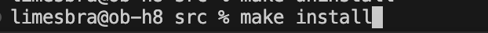
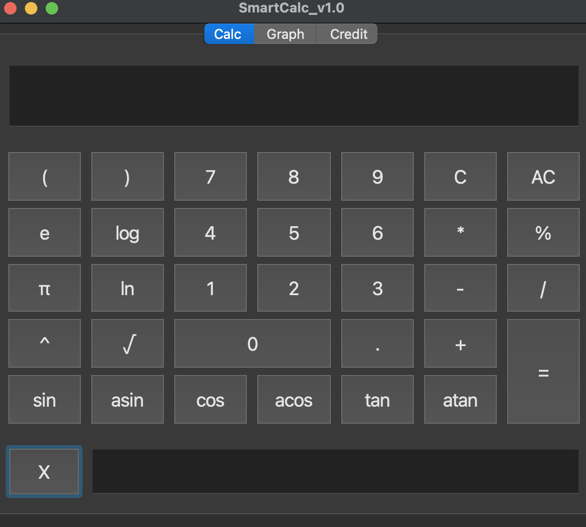
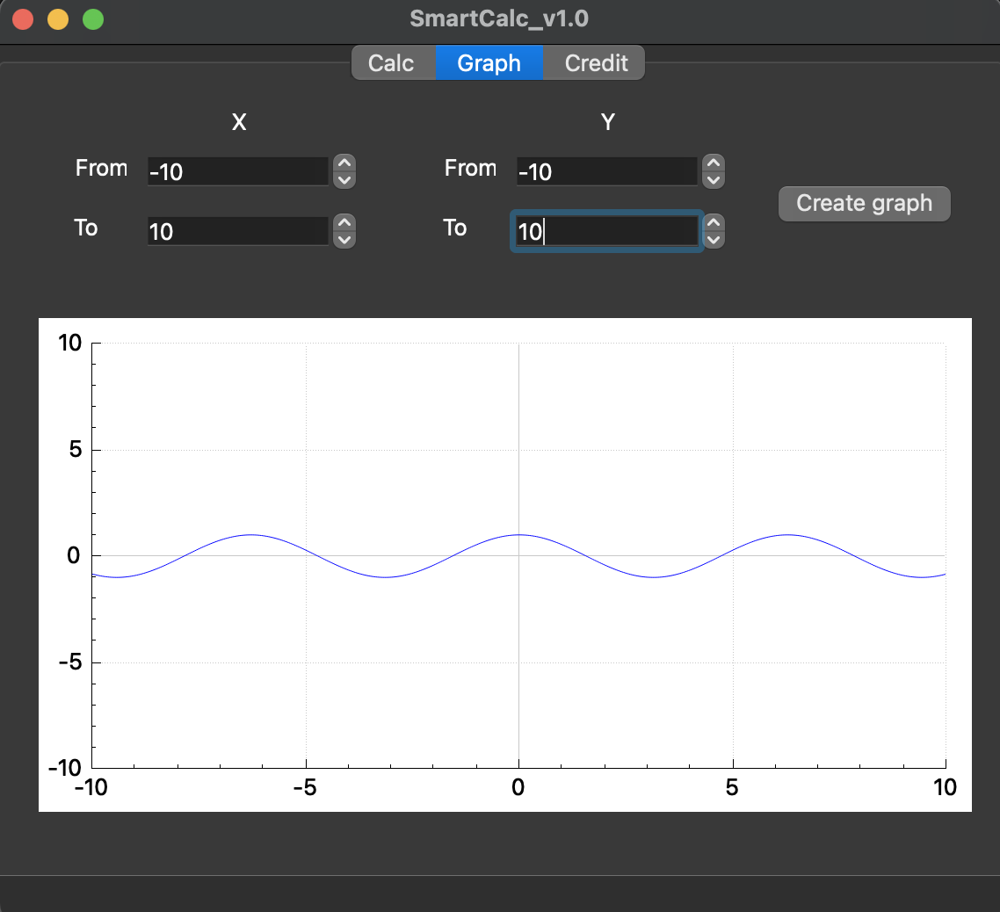
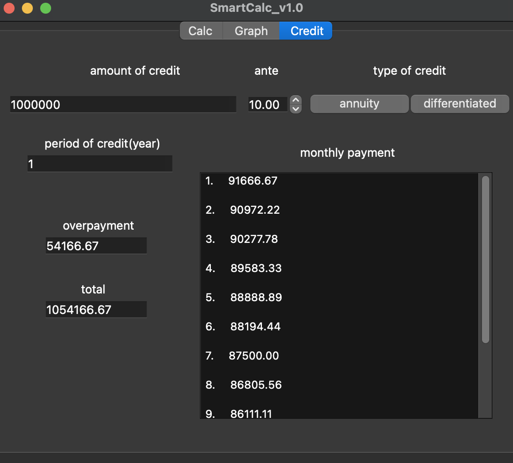
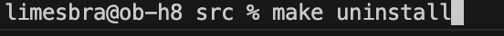

# SmartCalc v1.0

### Contents

1. [Installation](#installation)
2. [Calculator](#calc)
3. [Graph](#graph)
4. [Credit calculator](#credit)
5. [Removal](#removal)

### Installation

To install the program, go to the src folder and use the ***make install*** command.

The program will automatically start after installation.

If the program is already installed, then use the ***make run*** command to run it.

### Calculator

The module is designed to perform mathematical operations supporting trigonometric and other functions.  
The module works in three stages:  
1. Validity check.
    * There must be an operator between tokens;
    * parentheses must always be closed;  
    * entry must be mathematically correct;
2. Translation to reverse Polish notation.  
3. Сalculation.

### Graph

  
The module is designed to display graphs of functions.  
The domain of definition and scope of functions are limited to numbers from -1000000 to 1000000.

### Credit calculator

The module is designed to calculate monthly payments, total payments and overpayments for two different types of loans: annuity and differentiated

### Removal

Use the ***make uninstall*** command to uninstall the application.
